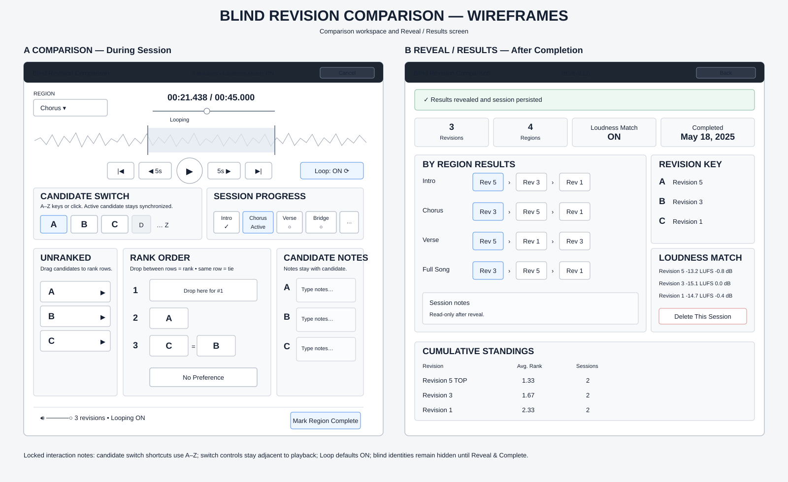

# Blind Revision Comparison Wireframes

Status: **Approved design reference** for issue #370 and implementation issues #375, #377, and #379.

These wireframes lock the intended information hierarchy and control grouping for the active comparison workspace and the reveal/results screen. They are not final visual styling specifications.

## Approved visual reference



## Comparison screen

```text
┌──────────────────────────────────────────────────────────────────────┐
│ Blind Revision Comparison   Session …   Loudness Match: ON   Cancel │
├──────────────────────────────────────────────────────────────────────┤
│ Region selector                 Current position / duration           │
│                                seek/progress                         │
│                                                                      │
│                        active-region playback                        │
│                    waveform/progress + loop bounds                   │
│                                                                      │
│        [⏮] [« 5s] [ Play/Pause ] [5s »] [⏭]   [Loop: ON]           │
│                                                                      │
│ Candidate switch controls — grouped directly with playback           │
│ [A] [B] [C] [D] …                         Region progress            │
│ A–Z keyboard shortcuts                         [Intro ✓] [V1 …]      │
├──────────────────────────────────────────────────────────────────────┤
│ UNRANKED            RANK ORDER                         CANDIDATE NOTES│
│ [A] ▶               1 [ drop / candidate ]            A [ … ]       │
│ [B] ▶               2 [ A ]                           B [ … ]       │
│ [C] ▶               3 [ C ][ B ]  ← tie               C [ … ]       │
│                     [ No Preference ]                                │
├──────────────────────────────────────────────────────────────────────┤
│ output volume     candidate count / unranked / loop state            │
│                                             [Mark Region Complete]    │
└──────────────────────────────────────────────────────────────────────┘
```

### Locked interaction/layout decisions

- Candidate switch controls are **immediately adjacent to the playback controls** so rapid A/B/C/… switching does not require moving to a distant part of the screen.
- Blind candidate keyboard shortcuts use **A–Z**, matching the visible blind identity.
- Candidate shortcuts are suppressed while focus is in notes or other text-entry controls.
- Space remains the primary play/pause shortcut where consistent with Studio keyboard behavior.
- Loop defaults **On** for Full Song and every custom region.
- Region selector/progress remains visible without leaving the comparison.
- Ranking stays below the listening controls so listening/switching remains the primary interaction.
- Every region starts with an explicit **Unranked** pool.
- Dropping a candidate onto an existing rank row creates a tie; dropping between rows creates a separate rank.
- Candidate notes remain associated with candidate identity, not rank position.
- **No Preference** is an explicit all-way tie.

## Reveal / Results screen

```text
┌──────────────────────────────────────────────────────────────────────┐
│ Blind Revision Comparison      REVEALED        Back to Comparisons   │
├──────────────────────────────────────────────────────────────────────┤
│ Session summary: candidates | regions | Loudness Match | completed  │
├──────────────────────────────────────────────────────────────────────┤
│ [By Region] [Cumulative Standings]                                  │
│                                                                      │
│ BY REGION RESULTS                              REVISION KEY           │
│ Intro      Revision 05 > Revision 03 > Rev 01  A → Revision 05      │
│ Chorus     Revision 03 > Revision 05 > Rev 01  B → Revision 03      │
│ Verse      Revision 05 > Revision 01 > Rev 03  C → Revision 01      │
│ Full Song  Revision 03 > Revision 05 > Rev 01                       │
│                                                 LOUDNESS DETAILS      │
│                                                 LUFS / applied gain   │
├──────────────────────────────────────────────────────────────────────┤
│ Session notes                                      Delete Session     │
│                                                    Export / actions   │
├──────────────────────────────────────────────────────────────────────┤
│ CUMULATIVE STANDINGS                                                  │
│ Revision | Avg placement | contributing sessions | evidence          │
└──────────────────────────────────────────────────────────────────────┘
```

### Locked reveal/results decisions

- Reveal is a dedicated completed-session screen, not a modal.
- Real revision identity is shown together with original blind identity.
- Session winner and cumulative Full Song TOP are distinct concepts and must not be visually conflated.
- Region results use the same project-region organization as the comparison workspace.
- Historical region name/start/end values come from the completed-session snapshot.
- LUFS and applied gain are visible only after reveal when Loudness Match was enabled.
- Individual session deletion and project-level history clearing remain explicit destructive actions.
- Ranking never auto-approves a revision.

## Implementation references

- #375 — setup flow, region management, and blind session shell
- #376 — per-region ranking interaction
- #377 — N-way playback coordinator and synchronized switching
- #379 — reveal/results, TOP integration, and history actions

The detailed behavioral specification remains `docs/BLIND_REVISION_COMPARISON.md`; this document is the approved wireframe/layout companion.